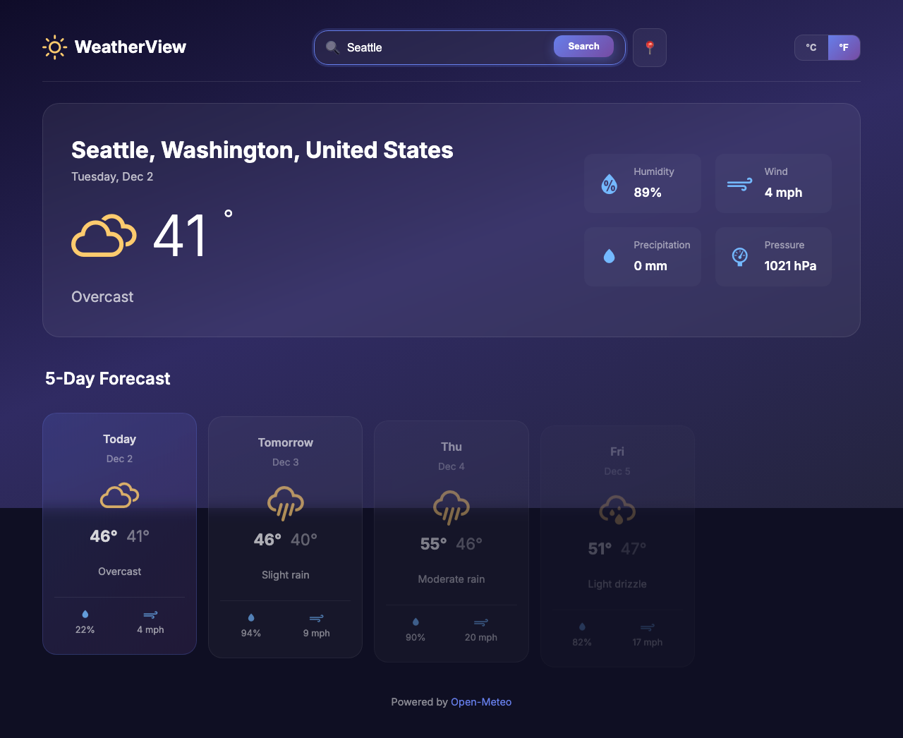

# WeatherView

A professional 5-day weather forecast website featuring a dark glassmorphism design. This project uses the [Open-Meteo API](https://open-meteo.com/) for weather data (no API key required).

> **Note:** This entire project (HTML, CSS, JavaScript, Tests, and Documentation) was created 100% using **GitHub Copilot**.



## Features

- **Search by City**: Instantly find weather for any location worldwide.
- **Current Weather**: Large hero section displaying current conditions.
- **5-Day Forecast**: Responsive grid of forecast cards.
- **Unit Conversion**: Toggle between Fahrenheit and Celsius.
- **Responsive Design**: Optimized for desktop, tablet, and mobile devices.
- **Glassmorphism UI**: Modern, dark-themed interface with frosted glass effects.

## How to Run

Since this is a vanilla JavaScript application using ES modules and fetching external APIs, it requires a local web server to run correctly (opening `index.html` directly in the browser will not work due to CORS policies).

### Option 1: Using Python (Recommended)

If you have Python installed (macOS/Linux usually do by default):

```bash
# Run on port 8080
python3 -m http.server 8080
```

Open your browser to [http://localhost:8080](http://localhost:8080).

### Option 2: Using Node.js

If you have Node.js installed, you can use `npx` to run a lightweight server without installing dependencies:

```bash
# Using http-server
npx http-server -p 8080
```

Open your browser to [http://localhost:8080](http://localhost:8080).

## Testing

This project includes End-to-End (E2E) tests using Playwright.

1. Install dependencies:
   ```bash
   npm install
   ```

2. Run tests:
   ```bash
   npm test
   ```

3. View test report:
   ```bash
   npm run test:report
   ```
